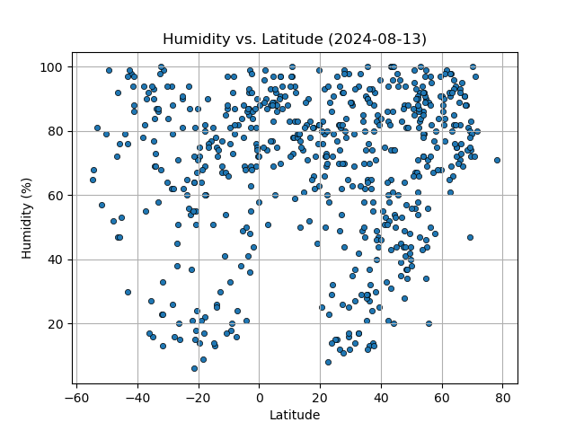
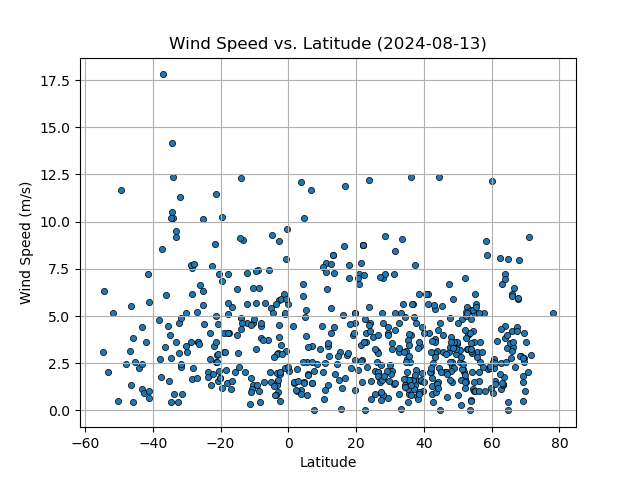
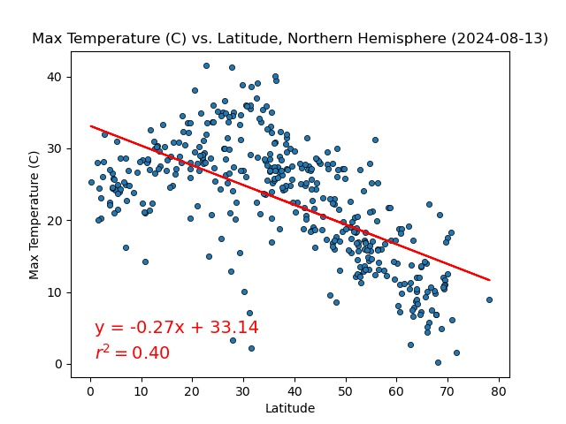
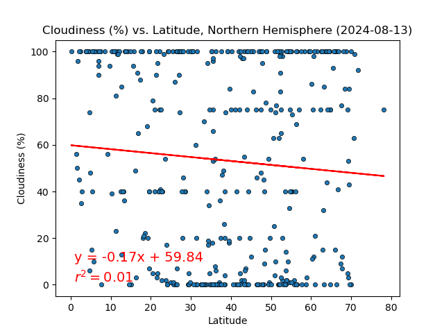

# python-api-challenge
Module 6 Challenge

The [WeatherPy.ipynb](WeatherPy/WeatherPy.ipynb) and [VacationPy.ipynb](WeatherPy/VacationPy.ipynb) are my completed notebook submissions. They both run without error and generate all of the required output. The outputs match those in the Bootcamp Spot description of the Challenge.

The output files, including the city data upon which my plots are based, are in the [output_data folder](WeatherPy/output_data).  Below are thumbnails of the various plots.

I wrote the code entirely on my own without collaboration or any online AI source (although Google was occasionally helpful for syntax). Several of the methods and techniques we learned in class.

We were also requested to draw some observations or inferences on the regression plots. I put these in the cells following each graph in the WeatherPy.ipynb notebook. 
